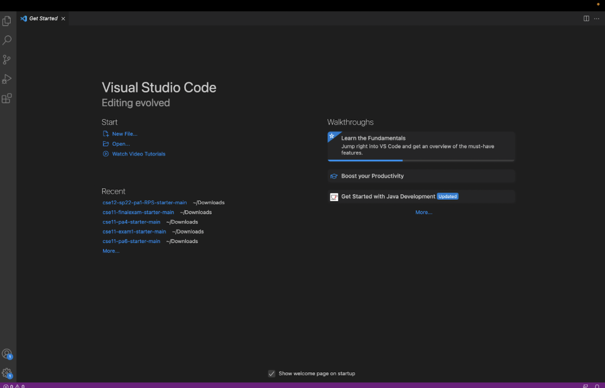
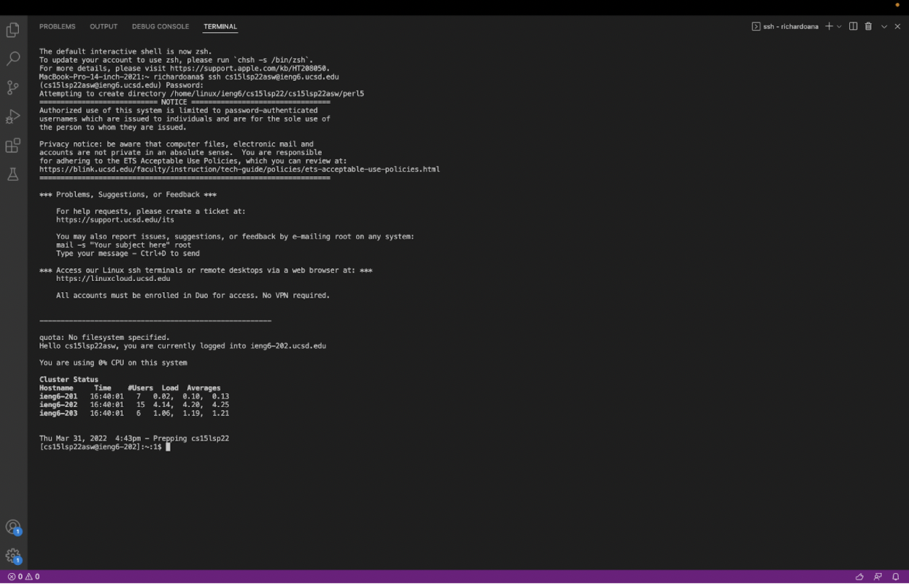
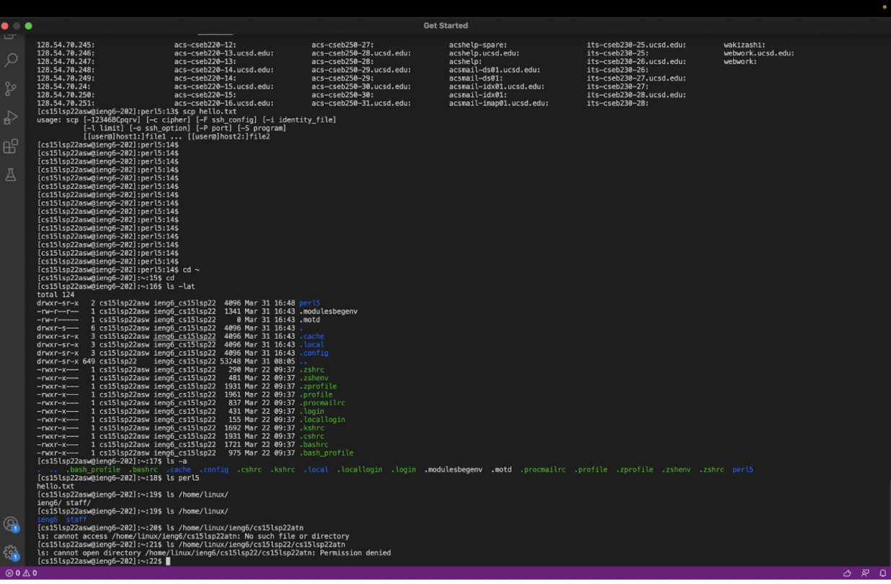
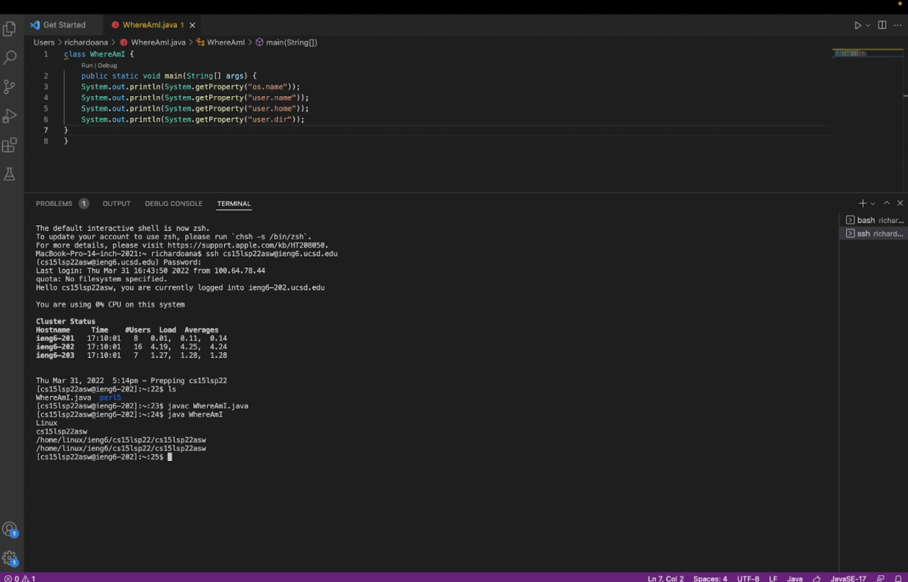
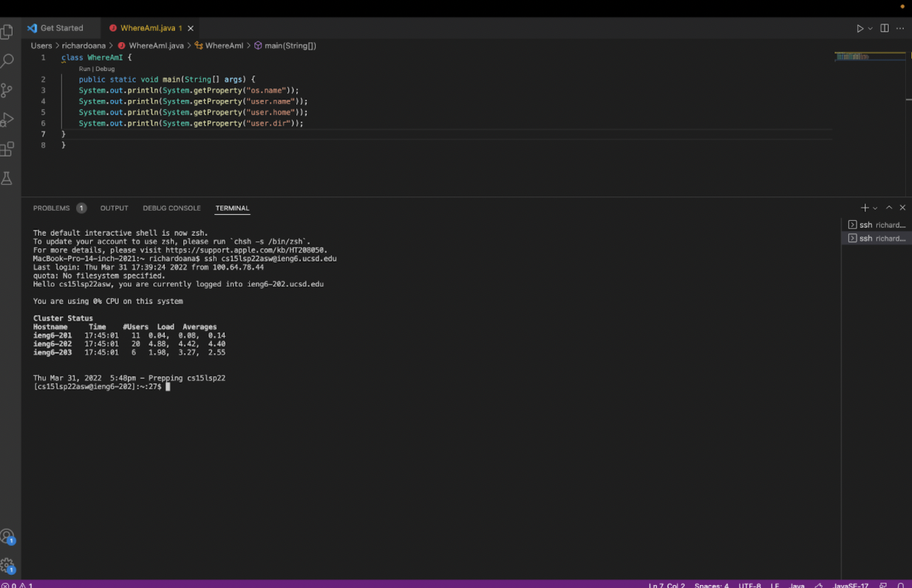
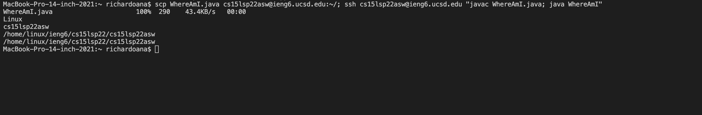

# How to log into a course-specific account on ieng6. 

## Installing VS Code

Go to the [Visual Studio Code](https://code.visualstudio.com/) website and follow the instructions to download and install it on your computer. There are different versions for all the major operating systems, like Windows or OSX, so make sure to choose the correct one for you.  

## Remotely Connecting

*Make sure to install [OpenSSH](https://docs.microsoft.com/en-us/windows-server/administration/openssh/openssh_install_firstuse) if you are on Windows!*

* Look up your course account (in this case for CSE15L): [Link](https://sdacs.ucsd.edu/~icc/index.php)
* Go back to VS Code to begin the steps to connect to a remote computer.
  1. Open a terminal in VS
  2. Type the command `$ ssh cs15lsp22zz@ieng6.ucsd.edu`, but replace "zz" with your own account letters.
  3. First time message will ask `Are you sure you want to continue connecting (yes/no/[fingerprint])?`, which you    will say `yes` to and enter your password. 
  4. Once logged in, your terminal will be connected to a remote computer located in the CSE basment, and your output will look similar to the image above.
  
## Trying Some Commands
 
Now that we are in terminal, we can try out different commands. 
1. `cd` Moves into a directory
2. `ls` See list of files
3. `pwd` Find out which folder you're in
4. `mkdir` Creates a new directory
5. `cp` Copies files and directories to another location

The image included was when I trying some of the commands out. Around the bottom, I tried to access another group member's directory, but since it was private, it was not accesible. 

## Moving Files with **scp**


Using the `scp` command, we can copy files from one computer to another through the terminal. In the image above, I created a file called `WhereAmI.java`.

To move over the file to a remote computer:
*Make sure to run this on CLIENT, not ieng6*
1. Input `scp <file> cs15lsp22zz@ieng6.ucsd.edu:~/` into the terminal, where you will prompted for a password.
2. Log back into the ieng6
3. You can check if the file is in the remote directory by using `ls` 
4. Run it with `javac` and `java` like usual

## Setting an SSH Key

*Image shows logging into ieng6 without a password*

`ssh-keygen` will allow a person to log in to the server, without going through the hassle of typing in the password everytime. By creating a public key for the server and private key for the client, as well as using the `scp` command, we can store the password to log in way quicker.

Step 1:
```
# on client (your computer)
$ ssh-keygen
Generating public/private rsa key pair.
Enter file in which to save the key
(/Users/<user-name>/.ssh/id_rsa): /Users/<user-name>/.ssh/id_rsa
Enter passphrase (empty for no passphrase):
```

*DO NOT ENTER A PASSHPHRASE*
Step 2:
```
Enter same passphrase again:
Your identification has been saved in
/Users/<user-name>/.ssh/id_rsa.
Your public key has been saved in
/Users/<user-name>/.ssh/id_rsa.pub.
The key fingerprint is:
SHA256:jZaZH6fI8E2I1D35hnvGeBePQ4ELOf2Ge+G0XknoXp0
<user-name>@<system>.local
The key's randomart image is:
+---[RSA 3072]----+
|                 |
|       . . + .   |
|      . . B o .  |
|     . . B * +.. |
|      o S = *.B. |
|       = = O.*.*+|
|        + * *.BE+|
|           +.+.o |
|             ..  |
+----[SHA256]-----+
```
Now two keys are created within one's system. Next thing we have to do is copy the public key into the `.ssh` directory of your account located on the server.
```
$ ssh cs15lsp22zz@ieng6.ucsd.edu
<Enter Password>
# now on server
$ mkdir .ssh
$ <logout>

# back on client
$ scp /Users/<user-name>/.ssh/id_rsa.pub
cs15lsp22zz@ieng6.ucsd.edu:~/.ssh/authorized_keys
# You use your username and the path you saw in the command
above
```
Finishing these steps will allow you to log in password free now!

## Optimizing Remote Running

*Image shows the use of semicolons to run multiple commands at the same time*

There are many shortcuts you can use to make your editing and command usuage more efficient. 
* You can use `""` to directly run something on the server, then exit.
* You can use `;` to run multiple commands in one line
* You can use the arrow to recall the previous line that was ran

