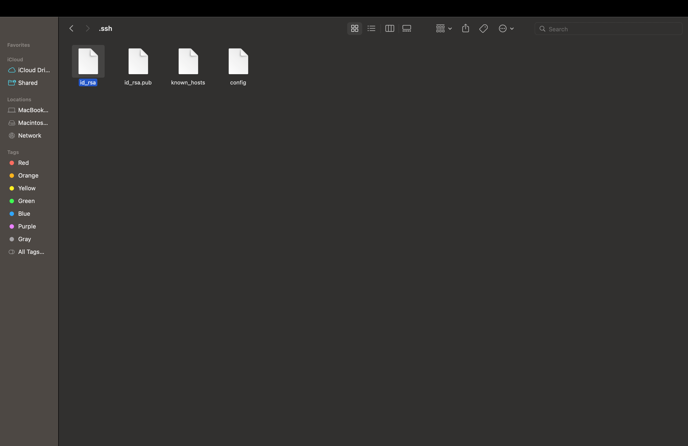

# Week 6 Lab Report 3

In this lab report, I will be demonstrating all three of the Group Choices from Lab 5.

## 1. Streamlining ssh Configuration

###  1A. Edit and config file, edited with VS Code

This is the location of the config file is stored. It is in a hidden .ssh folder directory that can be found within the User folder of the machine. The contents of the config folder are in the second picture.

### 1B. Logging with `ssh` command

With the config file stored, I can log in to the terminal a lot more efficiently as the file has stored my associated username. 

### 1C. Using `scp` to copy files

I copied a file from my local server into the ieng6 server by using `scp <file> cs15lsp22zzz@ieng6.ucsd.edu:~/`.

## 2. Setup Github Access from ieng6

### 2A. Public key on Github Server

I put my public key within Github's profile settings so it is stored on it's servers.

### 2B. Private key on user 

This is where my private key is stored within my coputer's directory

### 2C. Running Git `commit` and `push`

This is a demo example of me trying out the `commit` and `push` commands on the ieng6 server. Here is a link to the [commit](https://github.com/richarddau/skillDemonstration/commit/b452116f39719a5e3adb46fc267bd52d99a13904)

## 3. Copying with `scp -r`

### 3A. Copying whole markdown-parse directory

I copied my `markdown-parse-main` direcptry into the ieng6 directory. This was possible due to the use of the `scp -r` command.

### 3B. Running Tests on ieng6

Here is a demo of me trying to run tests off of the `markdown-parser` that was put into the ieng6 server.

### 3C. Combining Steps scp with ssh

I ran a command that copied an entire directory to a remote server, login to the remote server, go to the directory with the java files, and run the java test files. With the use of the quotation marks, I was able to do this in one line.

