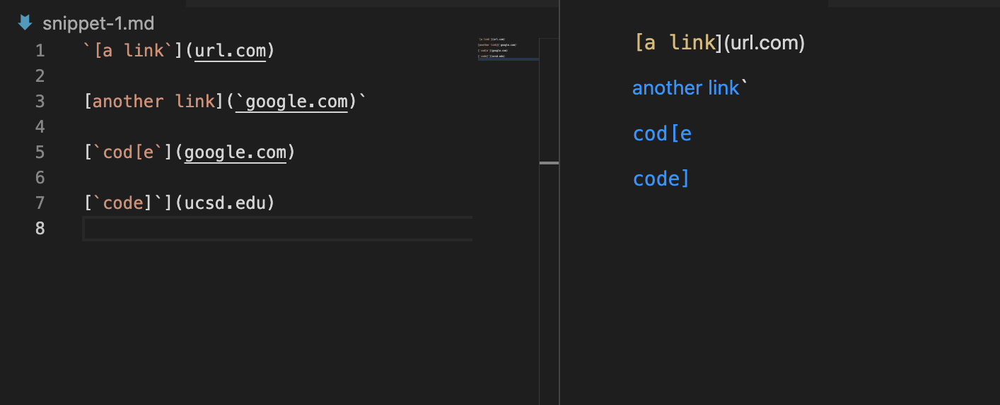
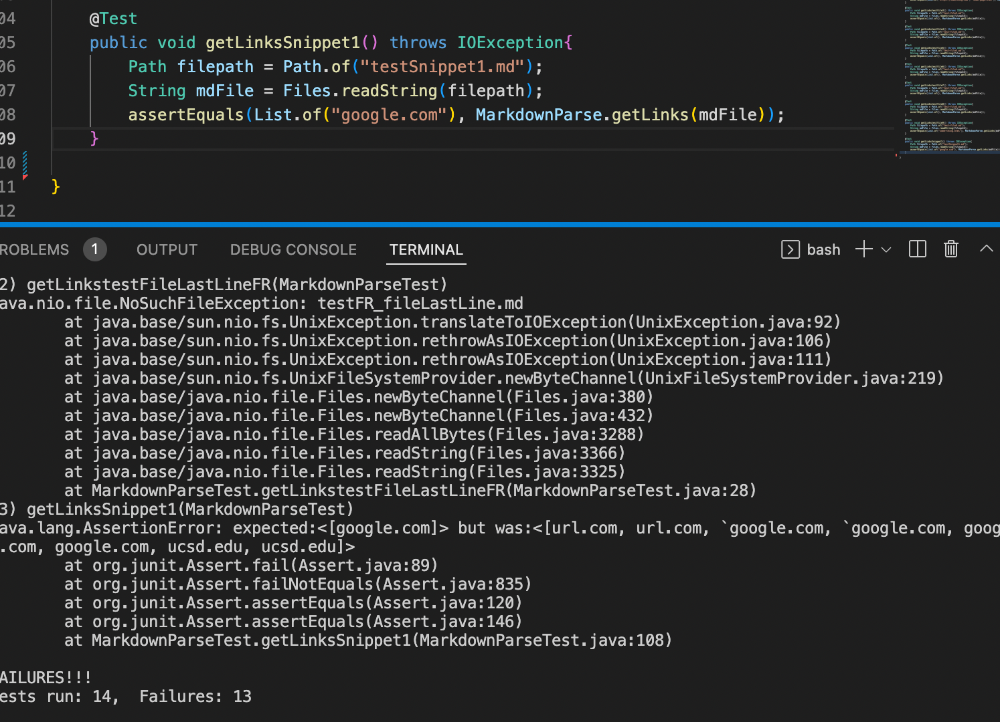
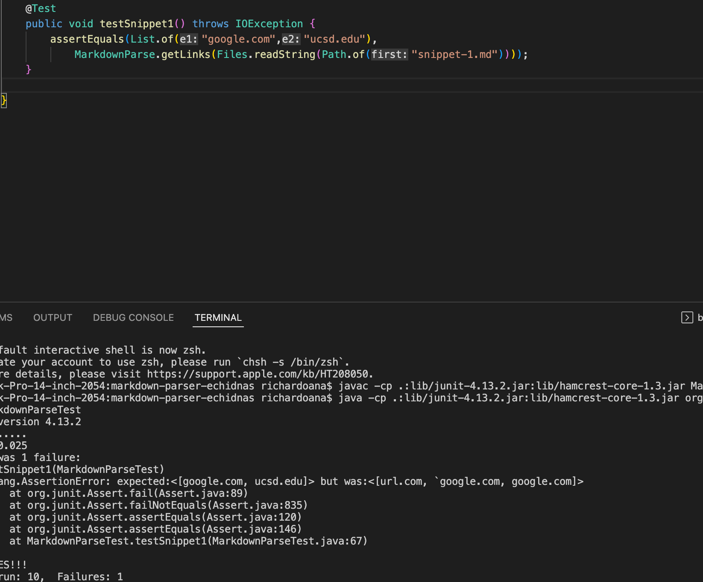
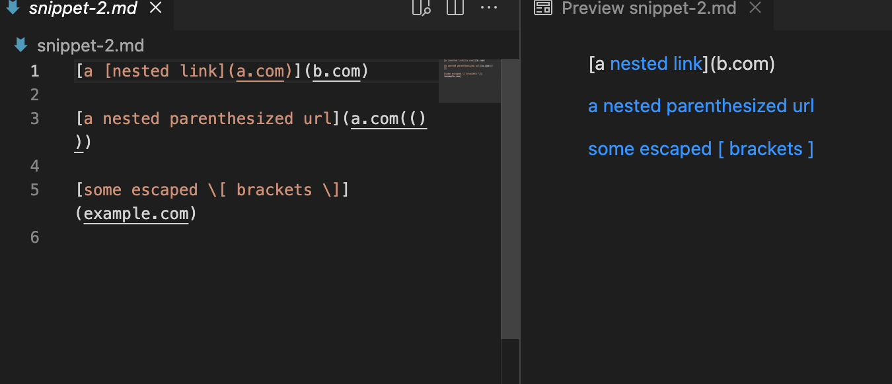
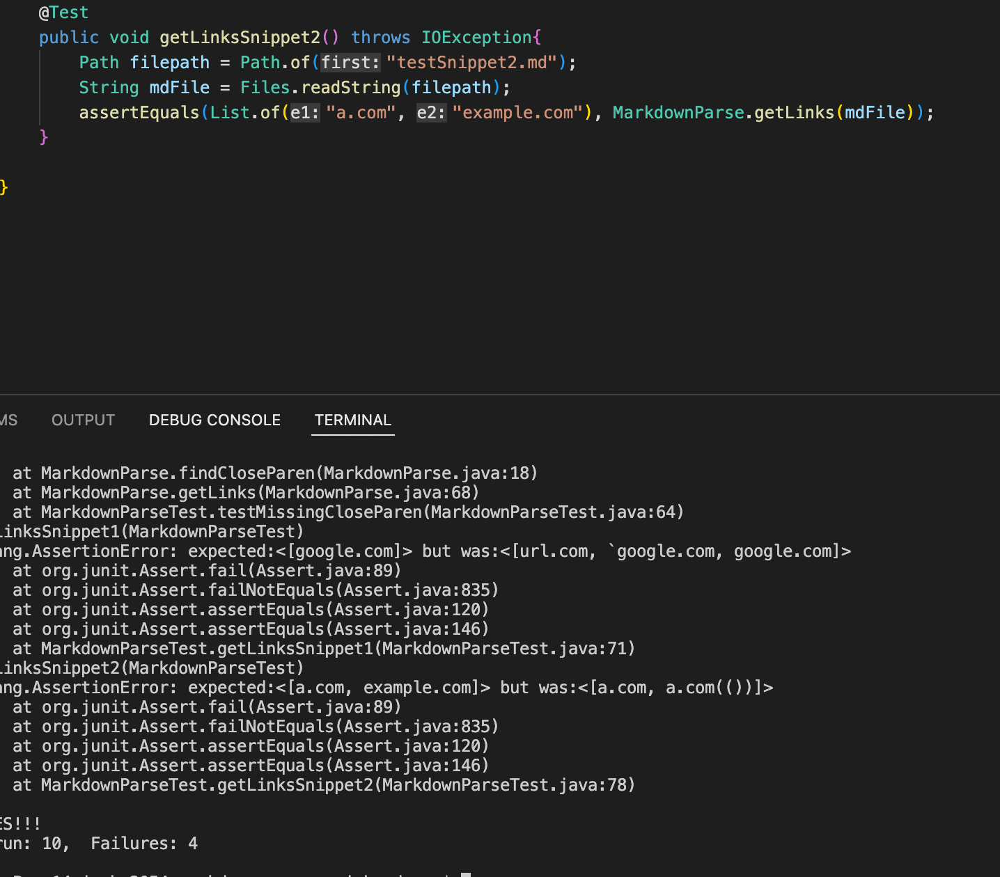
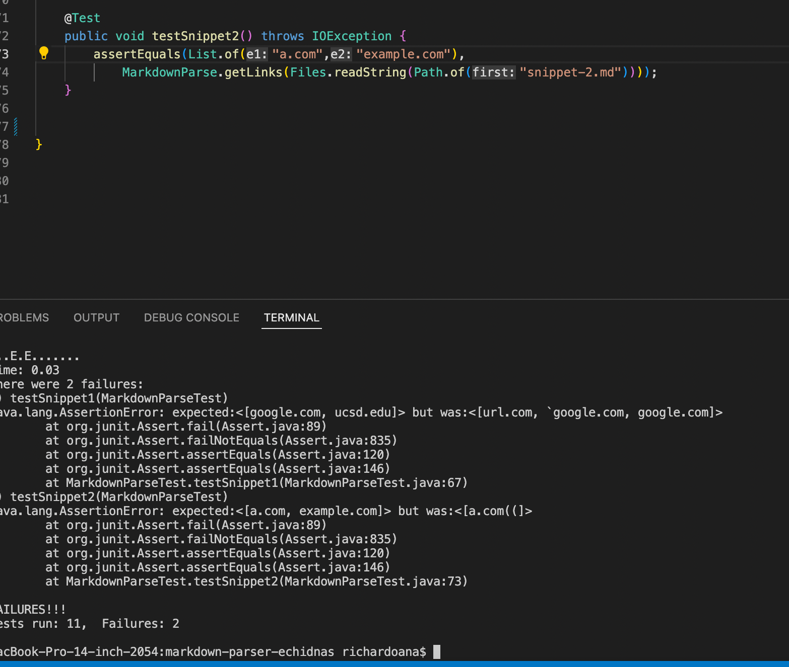
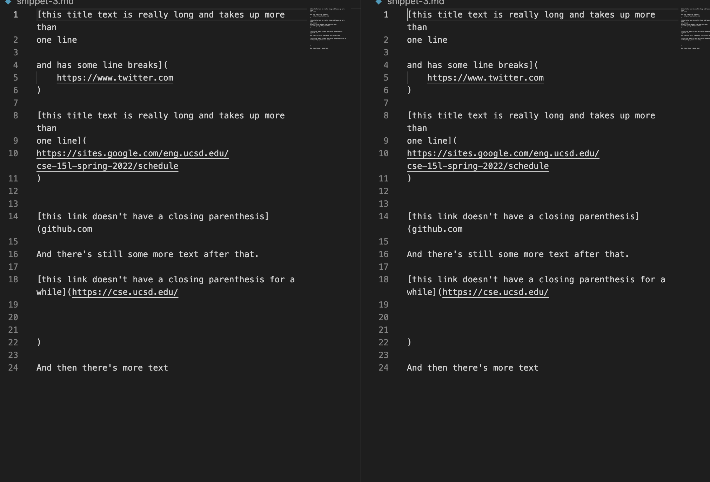
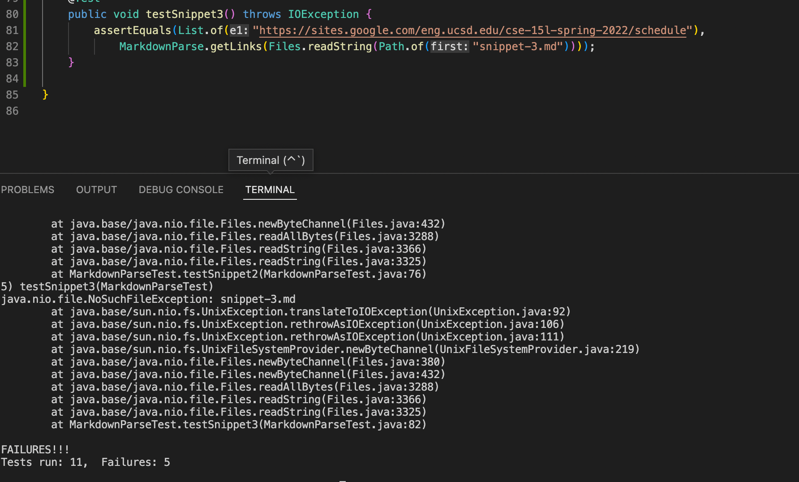
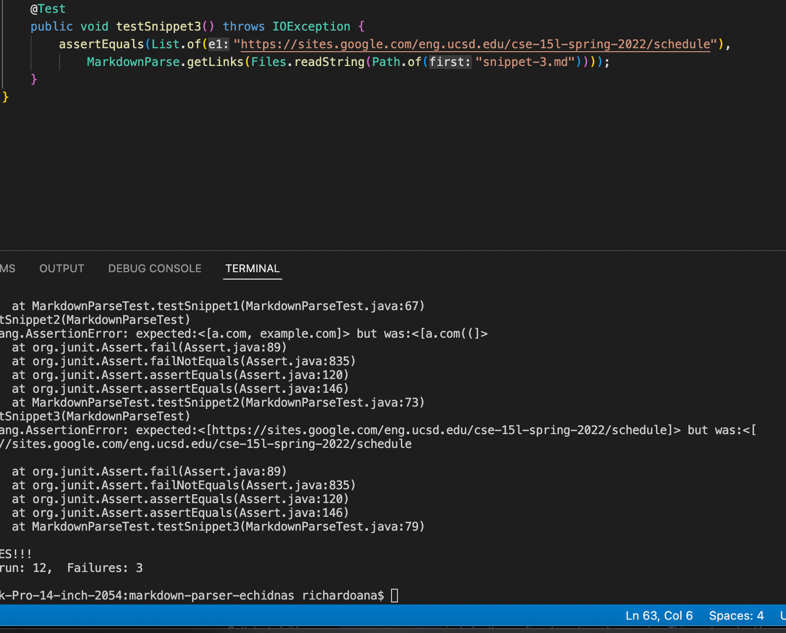

# Lab Report 4 Week 8 

[My Repo](https://github.com/richarddau/markdown-parser)

[Review Repo](https://github.com/AlexVazquez19/markdown-parser-echidnas)

## Snippet 1

### Preview of Snippet 1:

This is the preview of snippet1. The expected output would be the array `[google.com].`

### Test results for my own `MarkdownParseTest.java`

### Test results for reviewed repo

Both of the tests did not pass unfortunately. Looking at it, there is a change that allow links to be formatted in grave accents within the brackets. It is prioritizing the link format at the moment, rather then the code format. By fixing the code to prioritize checking grave marks before brackets should fix it. 

## Snippet 2

### Preview of Snippet 2:

The expected output should be `[a.com]`. The nested link here is being prioritized, so link 2 should not be added to the array as the file is parsed through.

### Test results for my own `MarkdownParseTest.java`

### Test results for reviewed repo

Both tests did not pass, but this time for different reasons. Echidnas does not allow for the prioritization of nested links/brackets within the first link (as the extra `]` exists, separating the first `]` from the parentheses). For a fix, I don't think it is possible for the nested brackets. It would require a lot of variables to check for a completed link as well as one must account for multi-layered nesting (ie triple nesting and etc).

## Snippet 3

### Preview of Snippet 3:

Looking at the preview, the multi-line link will be recognized. The output should bhe `[https://sites.google.com/eng.ucsd.edu/cse-15l-spring-2022/schedule]` The other links are not embedded within the text.

### Test results for my own `MarkdownParseTest.java`

### Test results for reviewed repo

Both tests fail because MarkdownParse.java has the newline characters when parsing. By continuing the parse if there is a newline or empty line the problem can be solved. This will allow the formatting from being added to the returned array.

