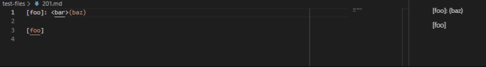
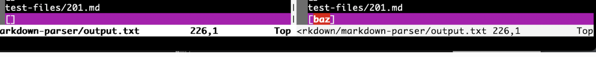
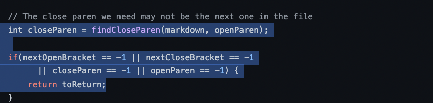
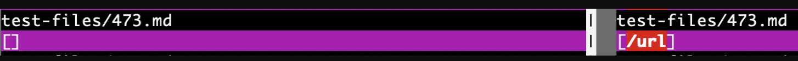
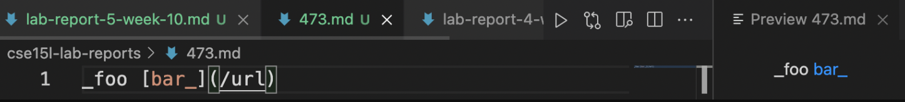
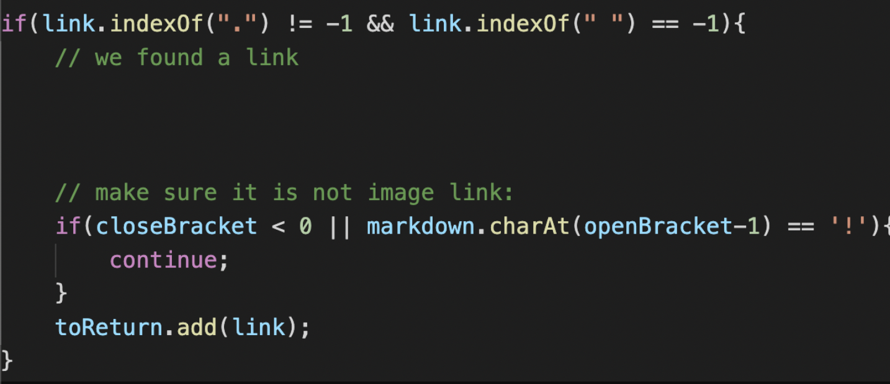

# Lab Report 5 Week 9 for CSE 15L

For today's lab, I'll be looking at two test files:

[Test File 201](https://github.com/nidhidhamnani/markdown-parser/blob/main/test-files/201.md)

[Test Fille 473](https://github.com/nidhidhamnani/markdown-parser/blob/main/test-files/473.md)

## Test File 201

The expected output of test file 201 should be an empty link `[]`. My implementation outputs an empty list since there isn't a any links that are valid within the file. The lab 9 version outputs out a list `baz` however.

Lab 9's code looks for the text within parentheses, no matter the location of the parentheses. That is why in the first image, the output is `baz` since the parentheses had followed the text. But, the markdown syntax's format does not follow this, there isn't no link found.

This is the error found in lines 67 - 72. There isn't a check where the parentheses should be following the ending bracket, which should be the case as files that have random text within them will act as links if there it comes after a bracket. However, these texts should not be considered links because, as seen in test file 201, they are not links due to the formatting.

## Test File 473

`bar` is highlated, which indicates it is a link. The lab implentation is correct as the expected output os `[/url]`. My version doesn't output `[/url]`, since it checks for a period within the link. 

This code snippet needs the `if` staement needs to be removed. 
